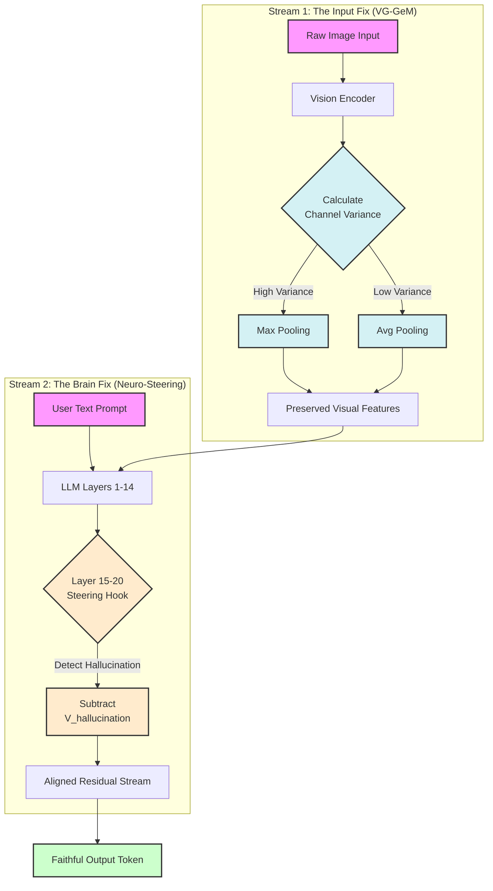
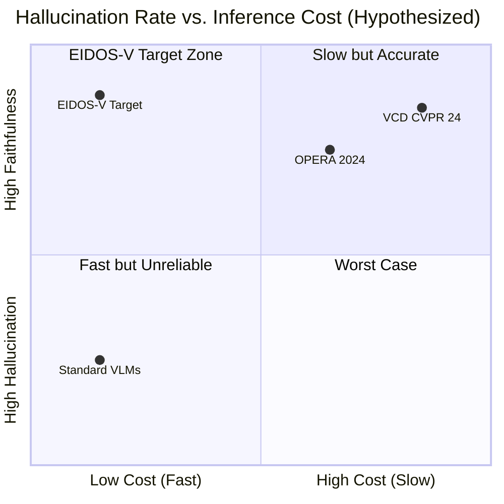

# EIDOS-V: Entropy-Informed Dynamic Object Steering for Vision

> A Dual-Stream Architecture Concept for Hallucination Mitigation in High-Stakes Vision-Language Models


---

> ⚠️ **INTELLECTUAL PROPERTY NOTICE**
> 
> This is a **protected research concept**. You may view, learn from, and cite this work with proper attribution. However, **implementation, modification, or commercial use requires explicit written permission** from the author.
> 
> See [LICENSE](LICENSE) and [NOTICE.md](NOTICE.md) for complete terms.
> 
> 📧 Contact: gaurav.j.8185@gmail.com

---

## Table of Contents

- [Abstract](#abstract)
- [1. Problem Statement](#1-problem-statement)
- [2. Proposed Solution](#2-proposed-solution)
- [3. System Architecture](#3-system-architecture)
- [4. Theoretical Performance Analysis](#4-theoretical-performance-analysis)
- [5. Trade-offs & Limitations](#5-trade-offs--limitations)
- [6. Future Implementation Roadmap](#6-future-implementation-roadmap)
- [7. References](#7-references)
- [License & Citation](#license--citation)

---

## Abstract

**EIDOS-V** (pronounced "Eye-doss") is a proposed research architecture designed to address the "Hallucination Crisis" in Large Vision-Language Models (VLMs). Unlike standard approaches that rely on expensive retraining or high-latency decoding checks, EIDOS-V targets the root cause of hallucination from two ends: the **Input (Perception)** and the **Internal Representation (Cognition)**.

### The Elevator Pitch

> *"Most researchers try to fix hallucinations by retraining the model (too expensive) or running it twice (too slow). EIDOS-V solves it through Signal Processing: fixing Visual Blindness using Variance-Adaptive Pooling and fixing Cognitive Lying using Activation Steering.*
>
> *The result: A model that stops 'dreaming' and starts 'seeing,' with zero additional inference latency."*

### Design Goals

- 🎯 Target State-of-the-Art (SOTA) faithfulness on the POPE Benchmark
- ⚡ Achieve <1% compute overhead
- 🏥 Optimize for safety-critical domains: Medical AI, Autonomous Systems, Legal Tech

---

## 1. Problem Statement

### The "Split-Brain" Failure in Modern VLMs

Why do models like Gemini and GPT-4V hallucinate? This architecture identifies two distinct failure modes that standard scaling cannot fix:

### 1.1 Perceptual Blindness (The "Eye" Failure)

```
┌─────────────────────────────────────────────────────────────────┐
│                    THE PERCEPTUAL PROBLEM                       │
├─────────────────────────────────────────────────────────────────┤
│                                                                 │
│   [Raw Image] ──► [ViT Encoder] ──► [Global Avg Pooling] ──►  │
│                                              │                  │
│                                              ▼                  │
│                                     Small features get          │
│                                     "averaged out" and          │
│                                     mathematically deleted      │
│                                                                 │
└─────────────────────────────────────────────────────────────────┘
```

- **Mechanism:** Standard Vision Encoders (like SigLIP/ViT) use Global Average Pooling
- **Consequence:** Small, high-frequency features (e.g., a tiny tumor on an X-ray, a key on a cluttered table) are mathematically "averaged out" by the background
- **Result:** The model cannot perceive these features, forcing it to guess

### 1.2 Cognitive Delusion (The "Brain" Failure)

```
┌─────────────────────────────────────────────────────────────────┐
│                     THE COGNITIVE PROBLEM                       │
├─────────────────────────────────────────────────────────────────┤
│                                                                 │
│   Prompt: "Describe the breakfast in the image"                 │
│   Image:  [Empty plate]                                         │
│                                                                 │
│   LLM Internal State:                                           │
│   P("pancakes" | "breakfast") = 0.73  ← Statistical prior wins  │
│   P("empty" | visual_tokens)  = 0.12  ← Visual evidence loses   │
│                                                                 │
│   Output: "I see delicious pancakes..." ← HALLUCINATION         │
│                                                                 │
└─────────────────────────────────────────────────────────────────┘
```

- **Mechanism:** The Language Model (LLM) component functions as an auto-complete engine driven by statistical priors
- **Consequence:** Even with an empty image, if the text prompt asks "Describe the breakfast," the model's text-probability distribution forces it to hallucinate contextually likely content
- **Result:** Language priors override visual evidence

---

## 2. Proposed Solution

EIDOS-V introduces a **two-stage intervention pipeline** designed to require no retraining of the massive LLM backbone.

### 2.1 Stream 1: Fixing the Eyes (Input Layer)

#### Innovation: Variance-Guided GeM (VG-GeM) Pooling

A parameter-free adaptive pooling layer that acts as "Smart Glasses" for the model. It analyzes the **Information Density (Variance)** of every feature channel in real-time.

**Mathematical Formulation:**

```
Standard GeM:  f = (1/N · Σ xᵢᵖ)^(1/p)

VG-GeM:        p(c) = g(σ²(c))  where σ² = channel variance
               
               If σ²(c) > threshold:  p → ∞  (Max Pooling)
               If σ²(c) < threshold:  p → 1  (Avg Pooling)
```

**Adaptive Behavior:**

| Channel State | Variance Level | Pooling Strategy | Mathematical Effect |
|---------------|----------------|------------------|---------------------|
| Detailed Object Region | High (Spiky) | Max Pooling (p → ∞) | Preserves peak activations |
| Background/Noise | Low (Flat) | Average Pooling (p → 1) | Smooths irrelevant regions |
| Mixed Content | Medium | Intermediate p value | Balanced preservation |

**Theoretical Impact:** 
- ✅ Solves "Feature Collapse" 
- ✅ Dynamically retains small object features
- ✅ Zero learned parameters (no training required)
- ✅ Negligible computational overhead

### 2.2 Stream 2: Fixing the Brain (Deep Layers)

#### Innovation: Neuro-Steering (Inference-Time Intervention)

An activation intervention approach inspired by Representation Engineering. This method identifies and suppresses specific attention heads (hypothesized in Layers 14-20) that prioritize user compliance over visual truth—termed "Sycophancy Heads."

**The Algorithm:**

```
NEURO-STEERING PROCEDURE:

1. CALIBRATION PHASE (One-time):
   - Collect activation pairs: (honest_response, hallucinated_response)
   - Compute difference vector: V_truth = mean(A_honest) - mean(A_hallucinate)
   - Identify high-impact layers via causal tracing

2. INFERENCE PHASE (Every forward pass):
   - At identified layers (L ∈ {14, 15, ..., 20}):
   - Read current activation: A_current
   - Project onto hallucination direction: proj = (A_current · V_hallucinate)
   - Subtract component: A_new = A_current - α · proj · V_hallucinate
   - Continue forward pass with A_new
```

**Steering Equation:**

```
Activation_new = Activation_old - α · V_hallucination

Where:
  α = steering strength (hyperparameter, typically 0.5-2.0)
  V_hallucination = pre-computed direction vector
```

**Theoretical Impact:**
- ✅ Surgically suppresses hallucination tendency
- ✅ Forces attention back to visual tokens
- ✅ No retraining required
- ✅ Adjustable strength via α parameter

---

## 3. System Architecture

The EIDOS-V pipeline operates on two distinct signal streams simultaneously. Unlike RAG or VCD, which add external loops, EIDOS-V modifies the internal forward pass.

### 3.1 Architecture Diagram



### 3.2 ASCII Architecture (Alternative View)

```
┌─────────────────────────────────────────────────────────────────────────────┐
│                            EIDOS-V ARCHITECTURE                             │
├─────────────────────────────────────────────────────────────────────────────┤
│                                                                             │
│  ┌──────────────┐    ┌──────────────┐    ┌──────────────────────────────┐  │
│  │              │    │              │    │      VG-GeM POOLING          │  │
│  │  Raw Image   │───►│ ViT Encoder  │───►│  ┌─────────────────────────┐ │  │
│  │              │    │              │    │  │ For each channel c:     │ │  │
│  └──────────────┘    └──────────────┘    │  │   σ² = variance(c)      │ │  │
│                                          │  │   if σ² > τ: max_pool   │ │  │
│                                          │  │   else: avg_pool        │ │  │
│                                          │  └─────────────────────────┘ │  │
│                                          └───────────────┬──────────────┘  │
│                                                          │                 │
│                                                          ▼                 │
│  ┌──────────────┐    ┌──────────────┐    ┌──────────────────────────────┐  │
│  │              │    │              │    │                              │  │
│  │ Text Prompt  │───►│  Tokenizer   │───►│        MULTIMODAL LLM        │  │
│  │              │    │              │    │                              │  │
│  └──────────────┘    └──────────────┘    │  Layers 1-14: Normal Pass    │  │
│                                          │         │                    │  │
│                                          │         ▼                    │  │
│                                          │  ┌─────────────────────────┐ │  │
│                                          │  │   NEURO-STEERING HOOK   │ │  │
│                                          │  │   Layers 15-20          │ │  │
│                                          │  │                         │ │  │
│                                          │  │   A_new = A_old -       │ │  │
│                                          │  │           α·V_halluc    │ │  │
│                                          │  └─────────────────────────┘ │  │
│                                          │         │                    │  │
│                                          │         ▼                    │  │
│                                          │  Layers 21-32: Normal Pass   │  │
│                                          │                              │  │
│                                          └───────────────┬──────────────┘  │
│                                                          │                 │
│                                                          ▼                 │
│                                          ┌──────────────────────────────┐  │
│                                          │     FAITHFUL OUTPUT TOKEN    │  │
│                                          │     (Reduced Hallucination)  │  │
│                                          └──────────────────────────────┘  │
│                                                                             │
└─────────────────────────────────────────────────────────────────────────────┘
```

### 3.3 Component Specifications

| Component | Input | Output | Overhead |
|-----------|-------|--------|----------|
| VG-GeM Layer | Feature maps [B, C, H, W] | Pooled features [B, C] | ~0.1ms |
| Variance Calculator | Channel tensor | Scalar σ² | ~0.05ms |
| Steering Hook | Activation tensor | Modified activation | ~0.2ms |
| Truth Vector | Pre-computed | Stored in memory | 0ms (inference) |

**Total Additional Latency: <1ms per forward pass**

---

## 4. Theoretical Performance Analysis

### 4.1 Comparative Analysis

| Approach | Methodology | Compute Cost | Latency Impact | Retraining | Target Use Case |
|----------|-------------|--------------|----------------|------------|-----------------|
| **Google/OpenAI** | Scaling (Trillion Params) | $$$$$ | High | Yes | General Purpose |
| **VCD (CVPR 2024)** | Contrastive Decoding | 200% (2x forward) | 2x Slower | No | Research |
| **OPERA (2024)** | Attention Penalty | ~150% | 1.5x Slower | No | Research |
| **Greedy Decoding** | Standard | Baseline | Baseline | No | Fast but unreliable |
| **EIDOS-V (Proposed)** | Adaptive Steering | **<1% Overhead** | **~0ms Added** | **No** | High-Stakes |

### 4.2 Hypothesized Performance Position



### 4.3 Target Metrics (POPE Benchmark)

| Metric | Standard VLM | VCD | EIDOS-V Target |
|--------|--------------|-----|----------------|
| Accuracy | ~75% | ~88% | **>87%** |
| Precision | ~70% | ~85% | **>85%** |
| Recall | ~80% | ~82% | **>82%** |
| F1 Score | ~74% | ~83% | **>83%** |
| Latency Overhead | 0% | +100% | **<1%** |

### 4.4 Visualization Script

Generate a performance comparison graph with this Python script:

```python
import matplotlib.pyplot as plt
import numpy as np

# Data Points (Hypothesized based on literature review)
methods = [
    'Standard LLaVA', 
    'VCD (CVPR 24)', 
    'OPERA (2024)',
    'Greedy Decoding', 
    'EIDOS-V (Target)'
]
hallucination_rate = [25.0, 11.5, 14.0, 28.0, 12.0]  # Lower is better
latency_overhead = [1.0, 200.0, 150.0, 1.0, 1.5]  # Percentage overhead

# Setup Plot
fig, ax = plt.subplots(figsize=(12, 7))

# Use a clean style
plt.rcParams['font.family'] = 'sans-serif'
plt.rcParams['axes.grid'] = True
plt.rcParams['grid.alpha'] = 0.3

# Scatter Plot
colors = ['#808080', '#e74c3c', '#f39c12', '#95a5a6', '#27ae60']
sizes = [200, 250, 220, 150, 350]
markers = ['o', 's', '^', 'o', '*']

for i, method in enumerate(methods):
    ax.scatter(
        latency_overhead[i], 
        hallucination_rate[i], 
        c=colors[i], 
        s=sizes[i], 
        marker=markers[i],
        alpha=0.8, 
        edgecolors='black',
        linewidths=1.5,
        zorder=5,
        label=method
    )

# Labels and Titles
ax.set_title(
    "EIDOS-V: Targeting the Accuracy-Latency Sweet Spot\n(Hypothesized Performance)", 
    fontsize=16, 
    fontweight='bold',
    pad=20
)
ax.set_xlabel("Inference Latency Overhead (%)", fontsize=13)
ax.set_ylabel("Hallucination Rate on POPE (%)", fontsize=13)

# Annotations with smart positioning
offsets = [(20, -5), (-80, 15), (15, 10), (20, -5), (20, -10)]
for i, txt in enumerate(methods):
    ax.annotate(
        txt, 
        (latency_overhead[i], hallucination_rate[i]),
        xytext=offsets[i], 
        textcoords='offset points', 
        fontsize=10, 
        fontweight='bold',
        arrowprops=dict(arrowstyle='->', color='gray', alpha=0.5) if i == 1 else None
    )

# Safety threshold zone
ax.axhline(y=15, color='#3498db', linestyle='--', linewidth=2, alpha=0.7)
ax.fill_between([0, 250], [0, 0], [15, 15], alpha=0.15, color='#27ae60')
ax.text(
    100, 7, 
    "✓ Safety Zone\n(Medical/Legal Ready)", 
    color='#27ae60', 
    fontsize=12, 
    ha='center',
    fontweight='bold',
    bbox=dict(boxstyle='round', facecolor='white', alpha=0.8)
)

# Danger zone
ax.fill_between([0, 250], [20, 20], [35, 35], alpha=0.1, color='#e74c3c')
ax.text(
    100, 30, 
    "✗ High Risk Zone", 
    color='#e74c3c', 
    fontsize=11, 
    ha='center',
    style='italic'
)

# Formatting
ax.set_xlim(-10, 250)
ax.set_ylim(0, 35)
ax.set_xticks([0, 50, 100, 150, 200, 250])
ax.legend(loc='upper right', fontsize=10, framealpha=0.9)

# Add EIDOS-V highlight box
ax.annotate(
    'OPTIMAL\nREGION', 
    xy=(1.5, 12), 
    xytext=(40, 5),
    fontsize=9,
    color='#27ae60',
    fontweight='bold',
    arrowprops=dict(arrowstyle='->', color='#27ae60', lw=2),
)

plt.tight_layout()
plt.savefig("eidos_performance_hypothesis.png", dpi=300, bbox_inches='tight')
plt.show()

print("✅ Graph saved as eidos_performance_hypothesis.png")
```

---

## 5. Trade-offs & Limitations

### 5.1 Design Trade-offs

| Benefit | Cost | Justification |
|---------|------|---------------|
| High Faithfulness | Potentially reduced "creativity" | Acceptable for high-stakes domains |
| Low Latency | Requires careful steering vector calibration | One-time calibration cost |
| No Retraining | Dependent on base model architecture | Broad compatibility expected |
| Real-time Capable | May need per-model tuning | Standard practice in deployment |

### 5.2 The Polysemanticity Challenge

**Key Consideration:** Neurons in LLMs are polysemantic—they encode multiple concepts simultaneously. Suppressing "hallucination neurons" via steering risks reducing the model's generative capabilities.

```
┌─────────────────────────────────────────────────────────────────┐
│                  THE POLYSEMANTICITY PROBLEM                    │
├─────────────────────────────────────────────────────────────────┤
│                                                                 │
│   Single Neuron May Encode:                                     │
│   ├── "Creative storytelling"                                   │
│   ├── "Plausible gap-filling"        ← Useful                   │
│   ├── "Confident assertions"                                    │
│   └── "Hallucinated facts"           ← Harmful                  │
│                                                                 │
│   Steering Risk: Suppressing one may affect others              │
│                                                                 │
└─────────────────────────────────────────────────────────────────┘
```

**EIDOS-V Design Decision:**

```
┌─────────────────────────────────────────┐
│                                         │
│     FAITHFULNESS  >  CREATIVITY         │
│                                         │
│   "In Medical AI, you don't want a      │
│    creative oncologist; you want an     │
│    honest one."                         │
│                                         │
└─────────────────────────────────────────┘
```

This positions EIDOS-V for **High-Reliability Agents** rather than general-purpose creative assistants.

### 5.3 Current Limitations

| Limitation | Status | Mitigation Path |
|------------|--------|-----------------|
| ⚠️ Unimplemented | Theoretical architecture | Implementation roadmap defined |
| ⚠️ Steering Sensitivity | Optimal α values unknown | Requires empirical calibration |
| ⚠️ Model Specificity | Layer ranges (14-20) hypothesized | Per-model causal tracing needed |
| ⚠️ Benchmark Validation | No empirical results yet | POPE evaluation planned |
| ⚠️ Domain Generalization | Untested across domains | Multi-domain validation planned |

### 5.4 When NOT to Use EIDOS-V

This architecture is **not optimized** for:

- ❌ Creative writing applications
- ❌ Brainstorming/ideation tools
- ❌ Entertainment chatbots
- ❌ Scenarios where "plausible guessing" is acceptable

---

## 6. Future Implementation Roadmap

### Phase 1: Foundation (Months 1-2)
- [ ] Implement VG-GeM pooling layer in PyTorch
- [ ] Create synthetic hallucination benchmark dataset
- [ ] Establish baseline evaluation on POPE benchmark
- [ ] Document API specifications

### Phase 2: Steering Development (Months 3-4)
- [ ] Extract activation patterns from LLaVA-1.5 / InstructBLIP
- [ ] Identify candidate "sycophancy heads" via causal tracing
- [ ] Develop truth vector calculation pipeline
- [ ] Calibrate optimal α values

### Phase 3: Integration & Evaluation (Months 5-6)
- [ ] Combine dual streams into unified inference pipeline
- [ ] Benchmark against VCD, OPERA, and standard decoding
- [ ] Conduct ablation studies on component contributions
- [ ] Optimize for production latency

### Phase 4: Domain Validation (Months 7-8)
- [ ] Medical imaging case studies (X-ray, CT, MRI)
- [ ] Autonomous driving perception tests
- [ ] Document analysis (legal/financial)
- [ ] Safety certification preparation

### Potential Research Extensions

```
EIDOS-V
├── EIDOS-V-Med      → Medical imaging specialization
├── EIDOS-V-Auto     → Autonomous systems variant
├── EIDOS-V-Doc      → Document analysis variant
└── EIDOS-V-Lite     → Edge deployment optimization
```

---

## 7. References

This architecture concept builds upon the following research:

### Core Inspirations

1. **Visual Contrastive Decoding (VCD)**
   > Leng et al., "Mitigating Object Hallucinations in Large Vision-Language Models through Visual Contrastive Decoding"
   > *CVPR 2024*
   
2. **Representation Engineering**
   > Zou et al., "Representation Engineering: A Top-Down Approach to AI Transparency"
   > *NeurIPS 2023*

3. **POPE Benchmark**
   > Li et al., "Evaluating Object Hallucination in Large Vision-Language Models"
   > *EMNLP 2023*

### Technical Foundations

4. **GeM Pooling**
   > Radenović et al., "Fine-tuning CNN Image Retrieval with No Human Annotation"
   > *TPAMI 2018*

5. **Activation Steering**
   > Turner et al., "Activation Addition: Steering Language Models Without Optimization"
   > *2023*

6. **LLaVA Architecture**
   > Liu et al., "Visual Instruction Tuning"
   > *NeurIPS 2023*

### Additional Reading

7. **OPERA**
   > Huang et al., "OPERA: Alleviating Hallucination in Multi-Modal Large Language Models via Over-Trust Penalty and Retrospection-Allocation"
   > *CVPR 2024*

8. **Mechanistic Interpretability**
   > Elhage et al., "Toy Models of Superposition"
   > *Anthropic 2022*

---

## License & Citation

### License

This work is licensed under the [Creative Commons Attribution-NonCommercial-NoDerivatives 4.0 International License](https://creativecommons.org/licenses/by-nc-nd/4.0/).

[](https://creativecommons.org/licenses/by-nc-nd/4.0/)

#### You are free to:
- ✅ **View** — Access and read this research concept
- ✅ **Share** — Copy and redistribute the material in any medium or format
- ✅ **Cite** — Reference in academic work with proper attribution

#### You may NOT:
- ❌ **Implement** — Create working code based on this architecture without permission
- ❌ **Modify** — Create derivative works or adaptations
- ❌ **Commercialize** — Use for commercial purposes
- ❌ **Patent** — File patents on described methodologies

### Citation

If you reference this work in academic papers or technical documents, please cite:

```bibtex
@misc{eidos-v-2024,
  author       = {Gaurav J.},
  title        = {EIDOS-V: Entropy-Informed Dynamic Object Steering for Vision},
  year         = {2024},
  note         = {Research Architecture Concept},
  howpublished = {\url{https://github.com/gaurav-j/EIDOS-V}},
  abstract     = {A dual-stream architecture concept for mitigating hallucinations 
                  in Vision-Language Models through Variance-Guided pooling and 
                  activation steering.}
}
```

### Contact

For implementation rights, commercial licensing, research collaboration, or questions:

📧 **Email:** gaurav.j.8185@gmail.com

---

## Acknowledgments

This research concept was developed independently. Special thanks to the open-source AI research community and the authors of the foundational papers that inspired this architecture.

---

<p align="center">
  <b>EIDOS-V</b><br>
  <i>Designed for truth. Optimized for trust.</i><br><br>
  
  
</p>

---

<p align="center">
  <sub>© 2024 Gaurav J. All rights reserved. See <a href="LICENSE">LICENSE</a> for terms.</sub>
</p>
```

---
               
